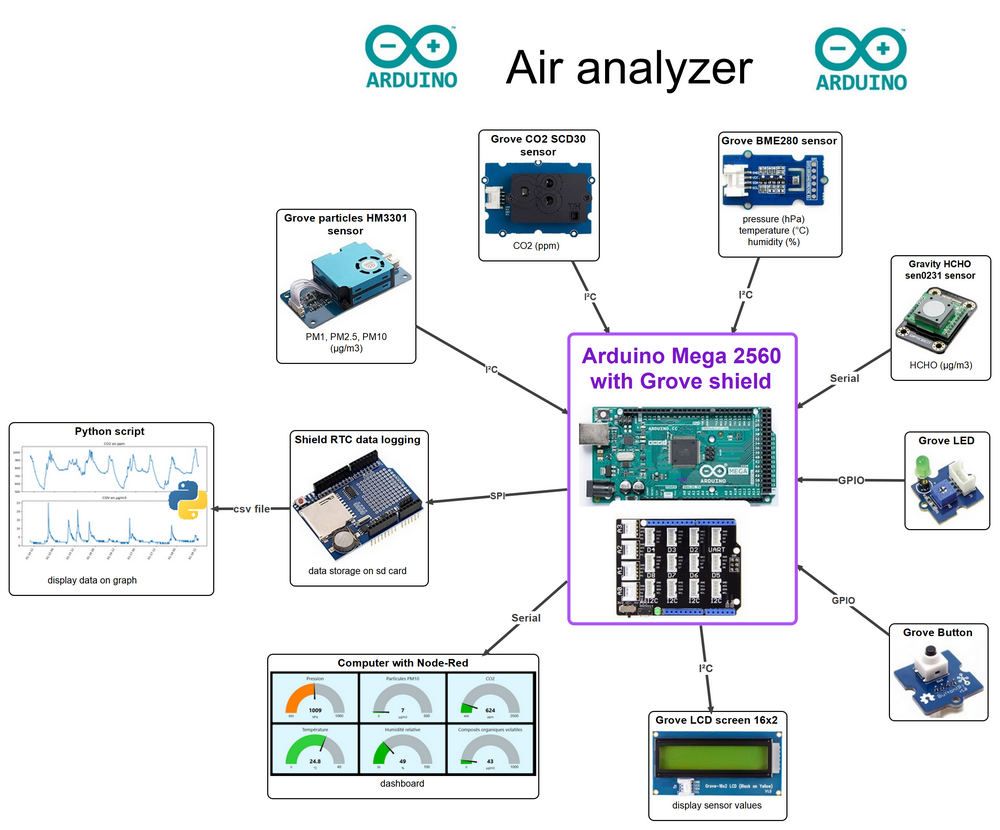

This is a air analyser programmed with Arduino. It can be used to study air quality.
It measures: temperature (°C), pressure (hPa), Humidity (%), CO2 (ppm), volatile organic compounds = VOC and specialy HCHO (µg/m3), and particles PM1, PM2.5 and PM10 (µg/m3).
Data can be,  displayed on LCD screen, displayed on computer screen with a Node-Red dashboard, stored on sd card then displayed on graph with python script.
It uses Seed studio Grove shield to simplify component connection.

